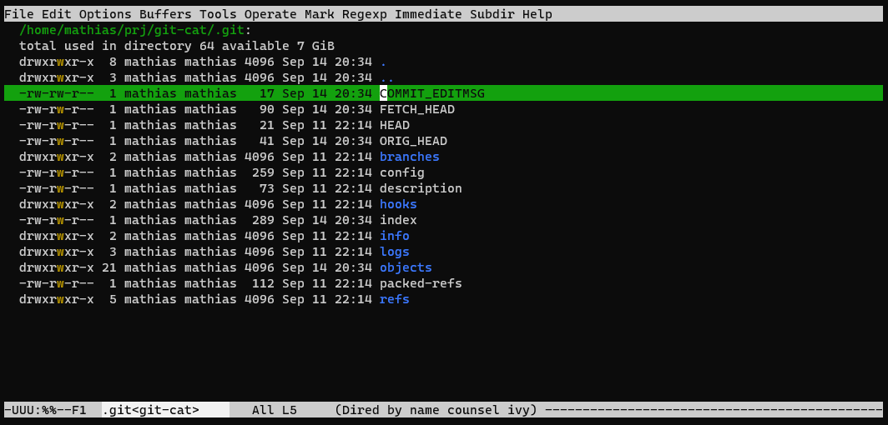
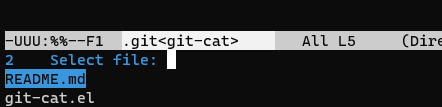
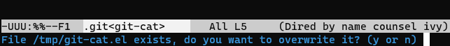
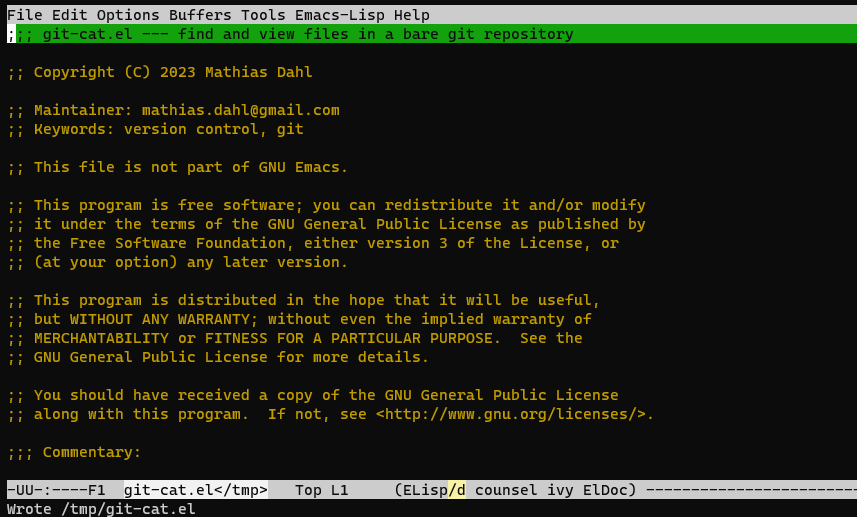

# git-cat

Use Emacs to find and view files in a bare git repository

## Why?

I have a number of bare git repositories to which I sync files from
and to different computers.  Now and then I need to find a file
when I'm inside a bare repository.  `git-cat' helps with that.

To use it, make sure you are in a bare git repository or inside a
.git directory, then type ```M-x git-cat RET```, enter a file name
pattern (a regexp), and type ```RET```.  Then select the file to view
among the hits.

The files will be saved in your temporary directory named with the
full path of the file in the repository.  Each slash is replaced by
an underscore.  If you want to view the same file again, you will be
asked if you want to overwrite the file in the temporary directory.

## Surely Magit can do this, right?

Perhaps I didn't try hard enough, but I could get Magit to list files
in a bare repo.

## See it in action

Below I'm in the .git folder of this repository:



Activating `git-cat':


I decide to list all files that has a period in the file name (the
input is sent to grep via a shell command and the period needs to be
escaped twice):



I now get a filtered list of all files in the repository and need to
select one of the files:

`git-cat' works very well with `ivy' and, I suspect with most
completion frameworks.

Since I opened this file before, I'm asked to overwrite it:



Finally, the file is shown:




